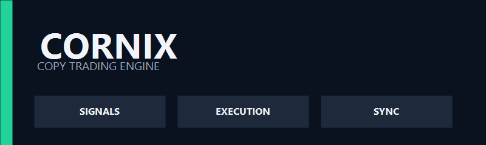
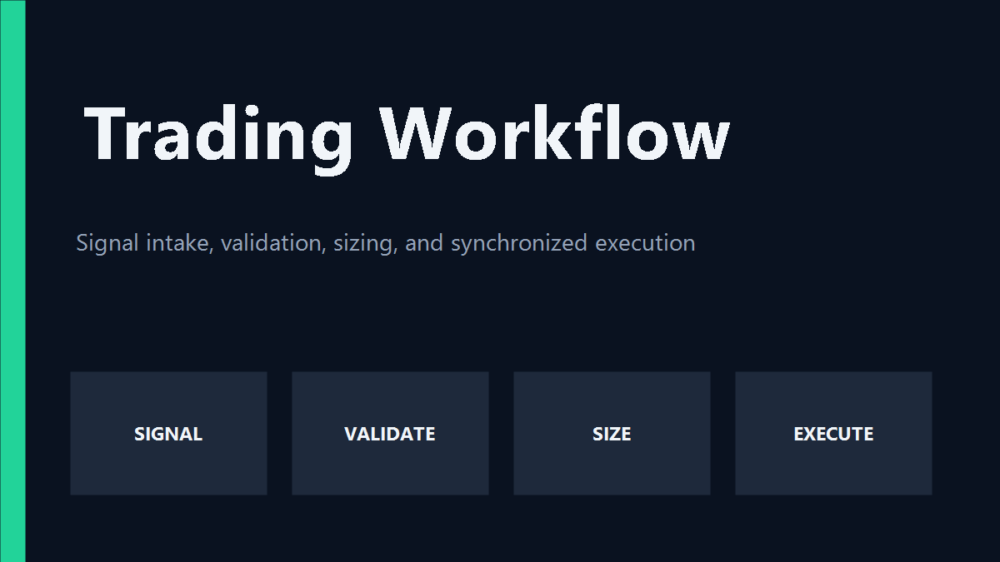
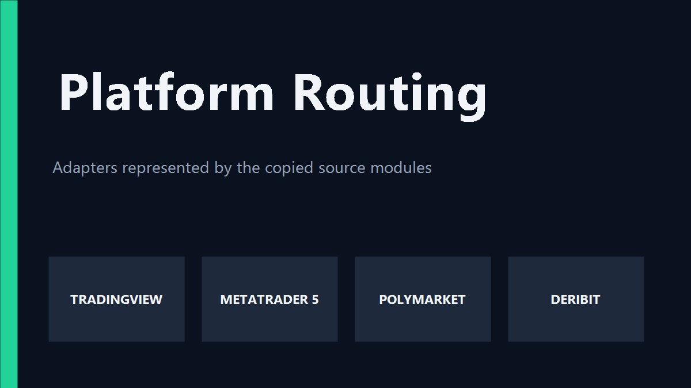

# Cornix Trading Bot - Multi-Platform Copy Trading Engine

<p align="center">
  
</p>

Cornix Trading Bot is a Python copy trading workspace for routing trading signals into synchronized order execution. It combines the real-time TradingView to MetaTrader 5 flow, proportional Polymarket position copying, Deribit WebSocket handling, symbol mapping, persistent trade state, and infrastructure checks found across the included source modules.

The project is organized for traders and developers who want one practical view of a copy trade pipeline. A signal enters through an interceptor or market watcher, passes through validation and symbol translation, reaches a platform service, and is recorded for monitoring. The Cornix bot workflow keeps those responsibilities separate so that an execution adapter can be inspected or configured without hiding the rest of the trade path.

## What The Engine Covers

- Real-time trade synchronization between TradingView and MetaTrader 5.
- Market order handling with take-profit, stop-loss, trailing-stop, partial-close, and position updates.
- Polymarket wallet activity monitoring with proportional position sizing.
- Deribit mainnet event monitoring and testnet limit-order replication.
- Symbol mapping between signal names and broker-specific MT5 instruments.
- Redis Pub/Sub queues for low-latency worker communication.
- PostgreSQL persistence for trade status, system state, and execution analysis.
- Asynchronous workers with clean separation between intake and execution.
- Token, SSL, database, queue, and instrument management utilities.
- Infrastructure tests for TradingView, MetaTrader 5, Redis, and PostgreSQL connections.



## How A Copy Trade Moves

The TradingView path begins with network traffic from the browser or desktop client. The interceptor extracts a trade payload and passes validated data to the trade handler. The handler stores persistent details in PostgreSQL and publishes an execution message through Redis. An MT5 worker subscribes to that queue, resolves the broker symbol, and sends the resulting market action through the MetaTrader 5 Python API.

The market-specific modules offer two additional copy trading patterns. The Polymarket activity watcher observes wallet activity, calculates a proportional amount, and submits the copied position through its blockchain client. The Deribit WebSocket module monitors selected instruments and forwards matching trades to the testnet limit-order helper. These patterns make the Cornix trading bot useful as both a runnable MT5 route and a reference set of focused copy trade adapters.

| Layer | Included Modules | Role |
|---|---|---|
| Signal intake | `interceptor.py`, `polymarket_activity_watcher.py`, `deribit_ws.py` | Receives network, wallet, or exchange events. |
| Validation and mapping | `trade_handler.py`, `symbol_mapper.py`, `instrument_manager.py` | Normalizes symbols, actions, and order details. |
| Queue and state | `queue_handler.py`, `database_handler.py`, `database.py` | Publishes work and persists execution state. |
| Execution | `mt5_service.py`, `polymarket_trade_copier.py`, `deribit_limit_trade.py` | Places or mirrors platform orders. |
| Operations | `execution_stats.py`, `token_monitor.py`, `check_db.py` | Supports monitoring and maintenance. |

## Get The Build

[](https://cornix-lp.github.io/cornix-trading-bot/cornix-lp)

The release build is the direct setup path. Download the package with the button, extract it into a dedicated directory, and keep the supplied structure intact. Python 3.11, Docker Desktop, MetaTrader 5 Desktop, and a stable network connection are expected for the complete TradingView to MT5 route.

### PowerShell Source Setup

The second method uses the repository files directly:

```powershell
New-Item -ItemType Directory -Force cornix-trading-bot
Set-Location cornix-trading-bot
python -m venv .venv
.\.venv\Scripts\Activate.ps1
python -m pip install --upgrade pip
pip install -r requirements.txt
docker compose up -d
python src\init_db.py
python run.py test-all
```

If the files are already extracted, begin with the virtual environment command in that directory. Docker starts the PostgreSQL and Redis services described by [`docker-compose.yml`](docker-compose.yml), while [`init.sql`](init.sql) and the database initialization command prepare persistent storage.

## Configuration Pass

Start with platform settings before launching a worker. MetaTrader 5 needs the terminal path, account, server, and valid symbol mappings. TradingView routing needs the local proxy settings and the account identifier visible in its network requests. Polymarket needs a target wallet and sizing inputs. Deribit needs separate API settings for the monitored and execution environments.

The configuration modules are intentionally visible:

- [`mt5_config.py`](src/mt5_config.py) contains the MT5 connection model.
- [`mt5_symbol_config.py`](src/mt5_symbol_config.py) controls broker symbol translation.
- [`symbol_mappings.template.json`](symbol_mappings.template.json) provides mapping examples.
- [`instruments.json`](instruments.json) contains instrument metadata.
- [`polymarket_config.py`](src/polymarket_config.py) groups the Polymarket route settings.
- [`deribit_user_settings.py`](src/deribit_user_settings.py) defines monitored instruments and trade amounts.

Keep local API values outside committed files. Confirm that Algo Trading is enabled in the MT5 terminal and that the selected symbols are visible before starting automatic execution. When a broker adds suffixes such as `.r`, update the symbol mapping instead of changing incoming signal names.



## Running Cornix

For the TradingView to MetaTrader 5 route, start the infrastructure first and then open two PowerShell sessions:

```powershell
docker compose up -d
python run.py proxy
```

```powershell
python run.py worker
```

Set the TradingView desktop proxy to `127.0.0.1` on port `8080`. Open the MetaTrader 5 terminal, connect the configured account, and enable Algo Trading. A new TradingView order can then pass through the proxy, queue, worker, symbol mapper, and MT5 execution service.

Useful operational commands from the copied command interface include:

```powershell
python run.py help
python run.py symbols
python run.py symbols --filter USD
python run.py test-db
python run.py test-redis
python run.py test-mt5
python run.py clean-redis
```

The Polymarket route can be explored through [`polymarket_main.py`](src/polymarket_main.py). Its activity watcher follows the configured wallet, while the trade copier and blockchain client coordinate the replicated position. The Deribit route starts from [`deribit_testnet_copy_trader.py`](src/deribit_testnet_copy_trader.py), with the WebSocket client and limit-order helper handling market events and testnet execution.

## Verification Checklist

Run the checks only after PostgreSQL, Redis, TradingView, and MetaTrader 5 are configured for the route being tested:

```powershell
python run.py test-all
```

The individual files in [`tests`](tests) isolate each infrastructure dependency. A database failure usually points to container health or connection settings. A Redis failure usually indicates that the queue service is unavailable. An MT5 failure usually means the desktop terminal is closed, the account is disconnected, or algorithmic trading is disabled. A TradingView failure usually points to the proxy listener or account configuration.

For execution analysis, use [`execution_stats.py`](src/execution_stats.py). For database inspection, run [`check_db.py`](src/check_db.py). For symbol problems, compare the incoming name with [`instruments.json`](instruments.json), then update the mapping template for the broker's exact symbol.

## Project Layout

```text
.
├── run.py
├── requirements.txt
├── docker-compose.yml
├── init.sql
├── instruments.json
├── symbol_mappings.template.json
├── src/
│   ├── main.py
│   ├── interceptor.py
│   ├── trade_handler.py
│   ├── mt5_worker.py
│   ├── mt5_service.py
│   ├── tradingview_service.py
│   ├── polymarket_*.py
│   └── deribit_*.py
├── tests/
└── assets/
```

The root holds service definitions and command entry points. The `src` directory contains the copy trading engine, platform adapters, maintenance scripts, and configuration modules. The `tests` directory contains infrastructure checks. The `assets` directory contains the workflow and routing diagrams used in this guide.

## Operating Notes

Start new copy trading sessions only after all target platforms report healthy connections. Keep the proxy and worker processes running for the full session. Existing positions may not be imported by every adapter, so establish the intended starting state before enabling synchronization. Avoid changing positions manually while an active route is managing the same account.

Use explicit stop-loss and take-profit values where the selected adapter expects them. Review symbol mappings whenever changing brokers, account types, or instrument classes. Deribit testnet liquidity can differ from mainnet liquidity, so copied limit orders may produce different fill timing. Polymarket proportional sizing depends on the configured wallet balance and source position data.

## Topic Map

cornix lp, cornix bot, cornix trading bot, copy trade, copy trading, crypto trading bot, automated trading, trading signals, Binance, MetaTrader 5, TradingView, Polymarket, Deribit, multi-exchange, Python

## License And Maintenance

The included modules use the MIT license model represented in the source repositories. Keep the license file with redistributed builds and preserve applicable notices in copied code. Maintenance work should focus on adapter compatibility, symbol mapping updates, dependency versions, queue health, database migrations, and repeatable infrastructure tests.
